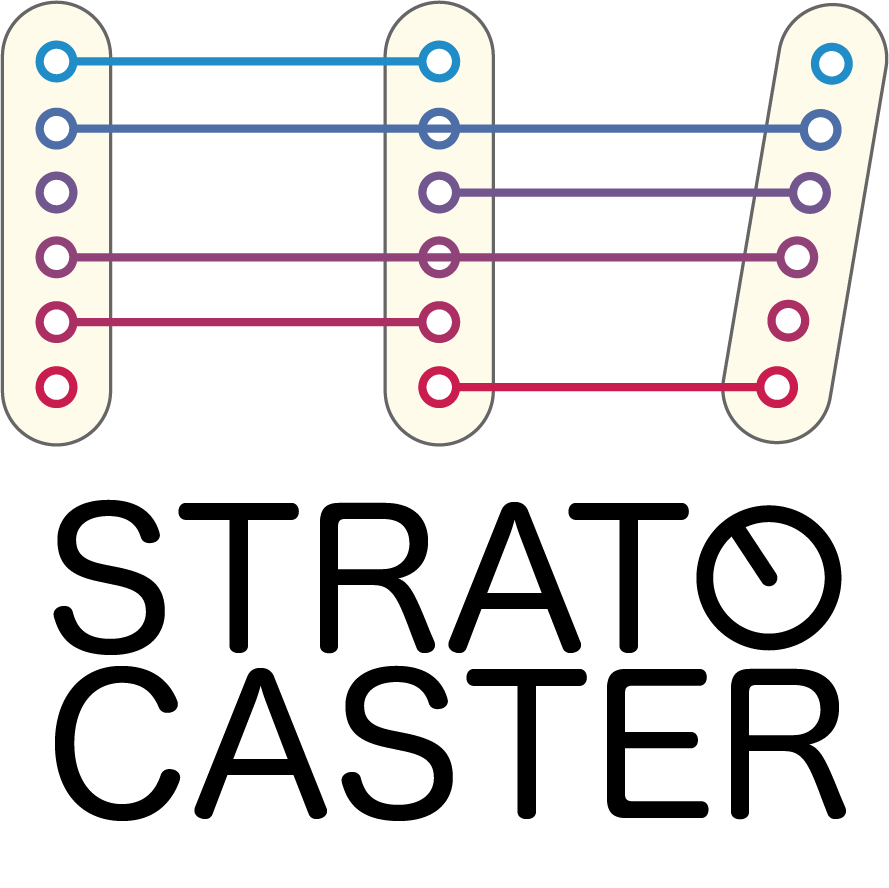

---

A library for proposing a prioritization of Transformations within AlchemicalNetworks.
Find the documentation for stratocaster on [Read the Docs](https://stratocaster.readthedocs.io/en/latest/).

## Installation

## Usage

## Contributing

## License

This project is released under the [MIT license](./LICENSE).