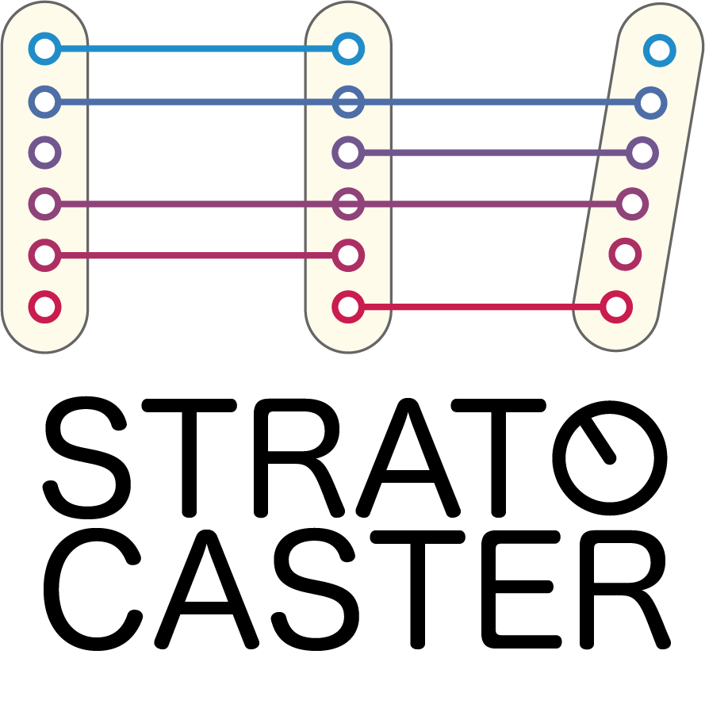

---

[](https://github.com/OpenFreeEnergy/stratocaster/actions/workflows/tests.yaml)

A library for proposing a prioritization of Transformations within AlchemicalNetworks.
Find the documentation for stratocaster on [Read the Docs](https://stratocaster.readthedocs.io/en/latest/).

## Installation

Install stratocaster via conda-forge:

```bash
conda install -c conda-forge stratocaster
```

Or install the latest development version via pip:

```bash
pip install git+https://github.com/OpenFreeEnergy/stratocaster.git@main
```

## Usage

Import a strategy and call `propose()` with your `AlchemicalNetwork` and existing results:

```python
from stratocaster.strategies import RadialGrowthStrategy

strategy = RadialGrowthStrategy(RadialGrowthStrategy.default_settings())

previous_results = {}
result = strategy.propose(alchemical_network, previous_results)
normalized_weights = result.resolve()
```

For more details, visit the [stratocaster documentation](https://stratocaster.readthedocs.io/en/latest/).

## Contributing

Please report bugs or request features via the [issue tracker](https://github.com/OpenFreeEnergy/stratocaster/issues).
Pull requests are encouraged for bug fixes, new strategies, and documentation improvements.

## License

This project is released under the [MIT license](./LICENSE).

---

stratocaster logo by Jenke Scheen, copyright Datryllic LLC, is licensed under [CC BY 4.0](https://creativecommons.org/licenses/by/4.0).
