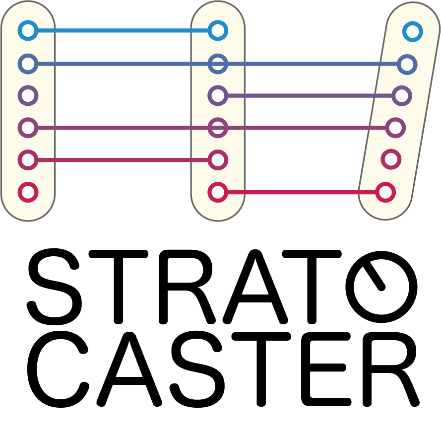

#######################################################################
alchemical effort allocation, automated
#######################################################################

**stratocaster** is a ``Strategy`` library built on top of `gufe <https://gufe.openfree.energy/>`_ for the `Open Free Energy`_ ecosystem: given an ``AlchemicalNetwork`` and any existing results for its ``Transformation``\s, a ``Strategy`` proposes where to apply additional computational effort to produce result data in an "optimal" way.
Different ``Strategy`` implementations define "optimal" differently, with the choice of ``Strategy`` determined by the application.

**stratocaster** includes many such ``Strategy`` implementations, as well as base classes and guidance for creating new ones.
A ``Strategy`` can be used directly on its own, or in combination with an automated execution system such as `alchemiscale`_ or `exorcist`_.
**stratocaster** is fully open source under the **MIT license**.

.. _Open Free Energy: https://openfree.energy/
.. _alchemiscale: https://alchemiscale.org/
.. _exorcist: https://github.com/OpenFreeEnergy/exorcist

.. toctree::
   :maxdepth: 2
   :caption: Contents:
   :hidden:

   installation
   getting_started
   user_guide
   developer_guide
   api
